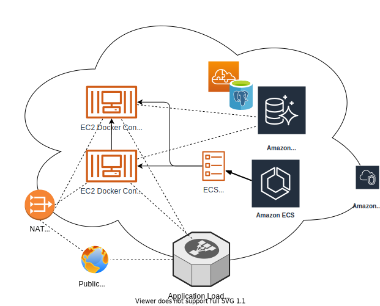

# Tower Jedi

## Docker, PostgreSQL, and Terraform

This app is built on python:3.7-slim-buster with nginx and Django added to the installation (see `Dockerfile`). In development, a postgres:12.2-alpine image is used to host the database.

This app is currently configured to deploy to AWS with the following configuration:

Internet traffic arrives at the Application Load Balancer (ALB) and is forwarded to the EC2 instances via the Virtual Private Cloud (VPC). The EC2 application instances (2 by default) are managed by Amazon Elastic Container Service (ECS), which hosts a Docker repository of the application image within Elastic Container Repository (ECR). The database is using Amazon new serverless Aurora configuration with a PostgreSQL 10.7-compatible database backend that autoscales based on app demand. The app (in the EC2 containers) can access the public Internet (Star Wars API, etc.) through a NAT gateway.

## Deployment

The configuration is managed by Terraform, which should be customized as follows:

-   In the terraform/ directory:
    -   customize the `variables.tf` file
    -   copy `secrets.auto.tfvars.sample` to `secrets.auto.tfvars` and customize
-   In the root (this) directory:
    -   copy `env.sample` to `.env` and customize
    -   review the Makefile (run `make help` in a terminal)
    -   ensure Docker Desktop is installed and configured
    -   in a terminal, run:
        -   `make install-prereqs` to install terraform, node, and yarn
        -   `make build` to build the Angular client and Docker image
        -   For development:
            -   `make dev-client` to build/watch Angular
            -   `docker-compose up` in a new terminal to start up the dev containers
        -   `aws configure` to setup AWS CLI -- use an IAM with sufficient account privileges to:
            -   create/destroy EC2, ECS, Aurora, ALB, and gateway instances, and security groups...
            -   setup CloudWatch logs...
            -   basically, an AWS "superuser"
        -   `make plan` to run terraform plan & check the configuration
        -   `make deploy` to deploy to AWS
